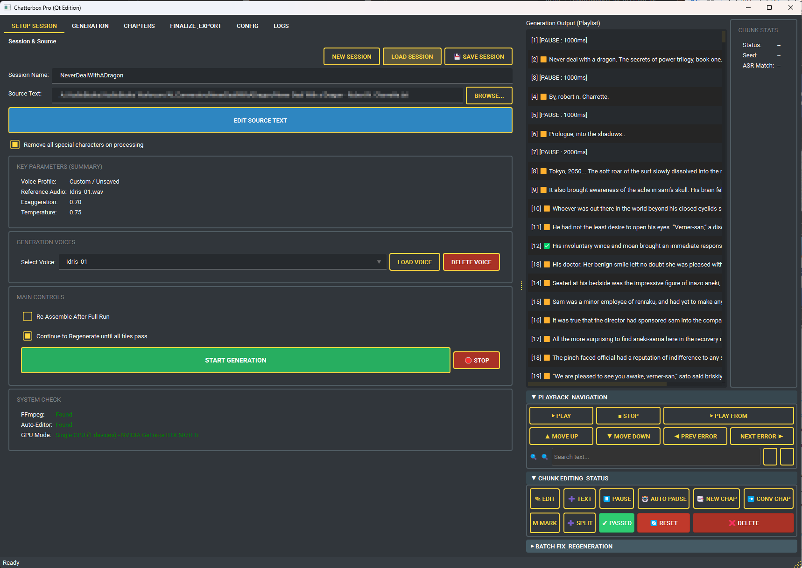
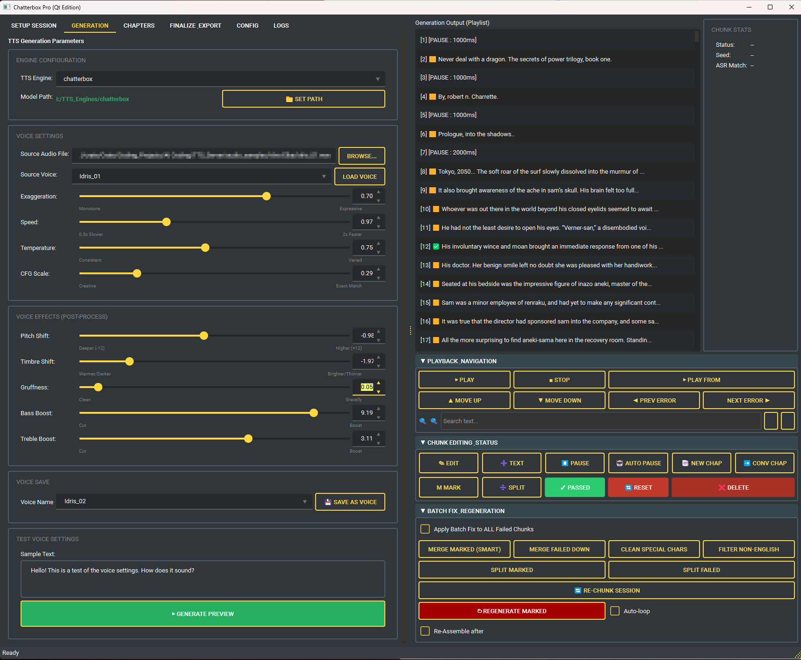
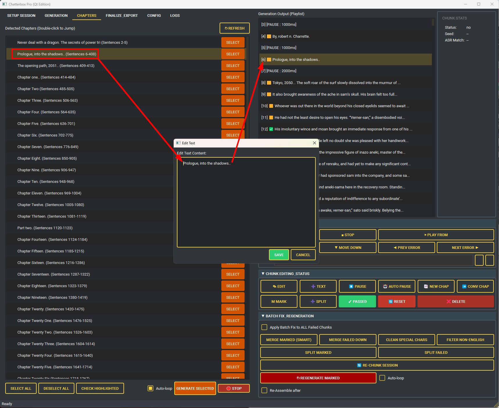
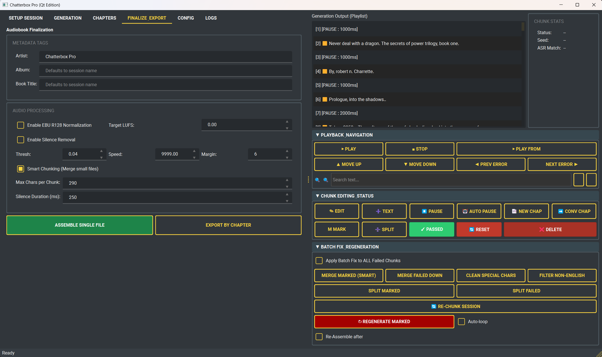
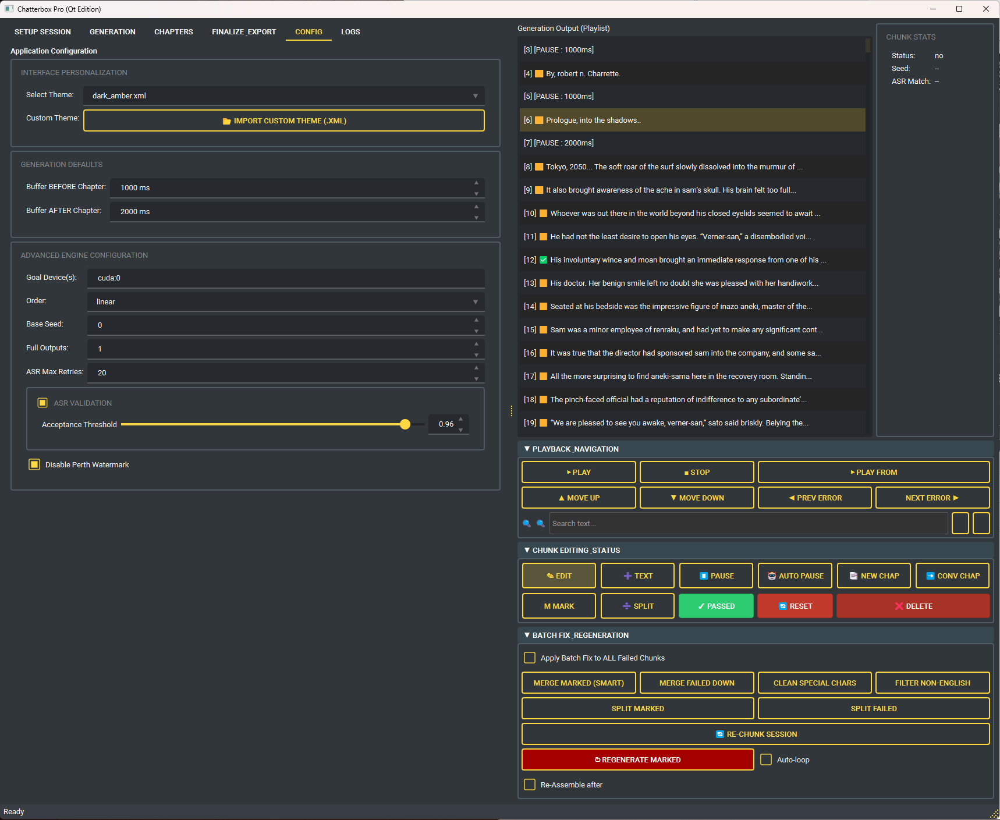

# Chatterbox Pro Audiobook Generator



**Chatterbox Pro** is a powerful, user-friendly graphical interface for generating high-quality audiobooks using cutting-edge Neural TTS. This tool is designed for creators, authors, and hobbyists who want to convert long-form text into professional-sounding audio with a consistent, cloned voice.

This application provides a complete end-to-end workflow: from text processing and voice cloning to multi-GPU audio generation and final audiobook assembly.



## ✨ Features

-   **High-Quality Voice Cloning**: Clone any voice from a short audio sample.
-   **Multi-Engine Core**: Don't get locked in. Seamlessly switch between **Chatterbox**, **F5-TTS**, and other integrated engines to find the perfect sound for your project.
    -   **Custom Models**: Load `.pth` files from anywhere on your system (e.g., massive external drives) without copying them into system folders.
-   **Intuitive GUI (PySide6)**:
    -   **Zero Lag**: Unlike the old Tkinter interface, the new Qt-based engine handles massive playlists (10,000+ items) without stuttering.
    -   **Modern & Responsive**: Full High-DPI scaling, smooth resizing, and native OS integration.
    -   **Theming**: Beautiful built-in Dark/Light themes that are easy on the eyes during long editing sessions.
-   **Comprehensive Text Processing**:
    -   Supports various input formats: `.txt`, `.pdf`, `.epub`, and with Pandoc installed, `.docx` and `.mobi`.
    -   Intelligent sentence and chapter detection.
    -   In-app text editor / smart splitter for reviewing and correcting source material.
    
-   **🛡️ Session Safety & Recovery**:
    -   **Triple-Layer Protection**: Prevents accidental data loss with safety gates that block saving empty sessions.
    -   **Auto-Backup**: Automatically creates `.bak` snapshots of your session data before every save.
    -   **Crash Recovery**: Detects load failures and offers instant recovery options.
-   **Powerful Generation Controls**:
    -   **Real-Time Voice Lab**: No more saving "templates" blindly. Type sample text, tweak parameters (Speed, Pitch, Style), and **hear the results instantly**. Iteration is now immediate.
    -   **Stop Anywhere (New)**: Prominent **Red "🛑 Stop"** buttons are now available directly in the Setup and Chapter tabs to instantly abort generation tasks.
    -   **Studio Effects (Post-Processing)**: Powered by **Pedalboard**. Apply a non-destructive **FX Chain** (EQ, Compression, High-Pass) to your generated audio *after* synthesis for a broadcast-ready sound.
    -   **Dynamic Voice Creation**: Load custom engines/models and tweak effects on-the-fly to create unique character voices instantly.
-   **Advanced Playlist Management (The Forge)**:
    -   **Chapter Mastery**: Select any line and **Convert to Chapter**, or insert new Chapter Markers/Breaks manually.
    -   **Status-Based Workflow**: Target lines based on ASR status (e.g., **"Merge All Failed"** or **"Split Failed"**) to fix difficult passages in bulk.
    -   **Mark & Merge**: Visually tag chunks with the **Gold Marker (🟨)** system. Toggle marks on/off and "Smart Merge" them into single coherent lines.
    -   **Auto-Pause Engine**: Automatically wrap chapters with granular silence buffers (e.g., 2000ms before/after) for perfect pacing.
    -   **Persistent Workspace**: The app remembers your Window Size, Position, and Theme preference across restarts.
-   **ASR-Powered Validation**:
    -   **Strict Mode**: Uses word-count validation to reject hallucinations (extra words) instantly.
    -   **Double-Protection Signal Check**: The system now pre-screens audio for **Signal Energy (RMS)** and **Trailing Noise**. Only files with valid speech energy are sent for transcription, preventing "Ghost Hallucinations" on empty audio.
    -   **Recursive Auto-Loop**: "Set it and forget it." The system will automatically retry failed chunks, splitting them if necessary, and re-rolling seeds indefinitely (or until a limit) until your entire book passes quality standards.
-   **Mastering Suite (Post-Processing)**:
    -   **Audio Normalization**: Ensure consistent volume levels (-3dB) across all chapters.
    -   **Smart Silence Removal**: Use `auto-editor` to tighten up gaps and flow.
    -   **One-Click Assembly**: Compile thousands of chunks into a single, polished audiobook file ready for distribution.




## 🔧 Installation

This project requires Python 3.10 or higher. An NVIDIA GPU with CUDA support is highly recommended for optimal performance.

### 1. System Dependencies

For full functionality, you need to install these command-line tools and ensure they are in your system's PATH.

-   **FFmpeg**: Required for audio normalization and assembling the final audiobook.
    -   Download from [ffmpeg.org](https://ffmpeg.org/download.html).
-   **auto-editor**: Required for smart silence removal.
    -   Install via pip: `pip install auto-editor`
-   **Pandoc (Optional)**: Required for processing `.docx` and `.mobi` files.
    -   Download from [pandoc.org](https://pandoc.org/installing.html).

### 2. Clone the Repository

```bash
git clone https://github.com/your-username/chatterboxPro_updated.git
cd chatterboxPro_updated
```

### 3. Create a Virtual Environment and Install Dependencies

```bash
# Create a virtual environment
python -m venv venv

# Activate it (Windows)
venv\Scripts\activate

# Install the required Python packages
pip install -r requirements.txt
```

## 🚀 How to Use

1.  **Launch the Application**:
    ```bash
    python chatter_pro.py
    ```

2.  **Tab 1: Setup**
      - **Create a Session**: Click "New Session". All files are saved in `Outputs_Pro/<session_name>`.
      - **Load Text**: Select your source file. Use the **Internal Editor** to verify sentence splitting.

3.  **Tab 2: Generation**
      - **Reference Audio**: Select a 10-30s WAV file of the voice you want to clone.
      - **Custom Models**: You can now point the engine to your own `.pth` / `.json` model files.

4.  **Tab 3: Playlist (The Forge)**
      - **Control the Flow**: Use **M Mark** (Toggle) and **Merge Marked** to refine your text chunks.
      - **Structure**: Insert **Chapter Headings** and use **Auto Pause** to wrap them in silence.
      - **Generate**: Start the process. Failed chunks turn Red (❌), Success turned Green (✅).
      - **Review**: Use **Auto-Loop** to fix red chunks automatically.

5.  **Tab 4: Finalize**
      - **Assemble**: Compile everything into a single audiobook file or export by Chapter.

## 📜 Licensing

Chatterbox Pro is released under a dual-license model (AGPLv3 / Commercial). See `LICENSE` for details.

## 🙏 Acknowledgements

Built on top of the powerful **Chatterbox TTS model** by Resemble AI. All credit for the underlying speech synthesis technology goes to the original creators.
